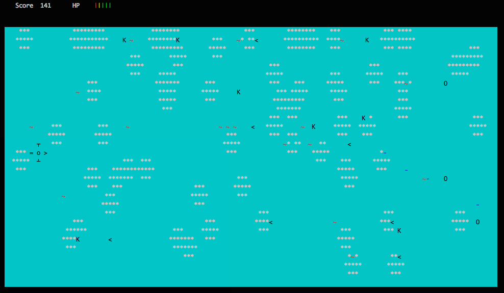

# ft_retro
A side scroller shooter in C++ and using ncurses library for display.

The project:

As a two days school project, the goal was to create a 2D side scroller shooter in C++ in teams of two.
We decided to make a horizontal shooter. Each element of the game is an object entity, that we destroy after its use.

The point of this project was double: learning to effectively and practicely use objects in C++ programming, as well as organizing the code in object-oriented team programming.

